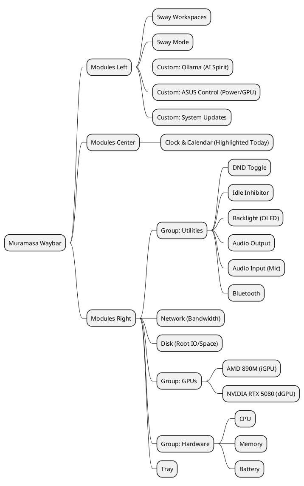
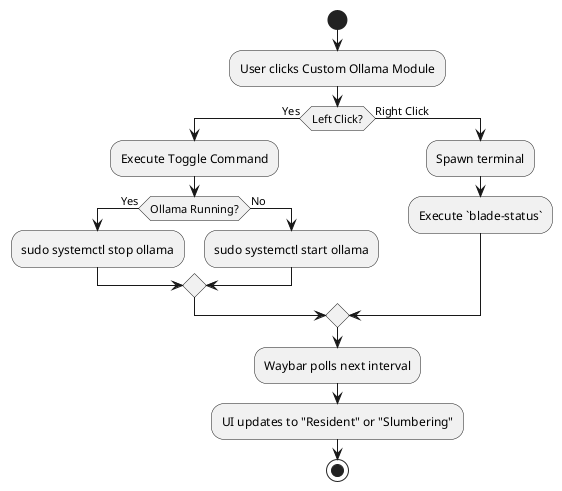
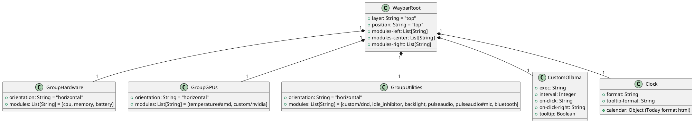

# Project Design Document: Waybar Overhaul for Muramasa

## 1. Overview
The goal of this overhaul is to transform the Waybar interface on Muramasa into an elite, highly functional, and aesthetically cohesive telemetry dashboard. It will support heavy software engineering and AI workflows without breaking the established "Tokyo Night Storm" visual theme and "ronin/mono no aware" persona.

This design document outlines the structural layout of the Waybar, the data flow for custom polling modules, and the necessary CSS grouping strategies to achieve a seamless, Garuda-like elegance.

## 2. Waybar Layout Architecture

The Waybar will be segmented into three distinct areas, aggressively grouping related information to prevent visual clutter while exposing critical metrics.

*   **Modules Left:** Navigation and System State
    *   `sway/workspaces`: Workspace indicators.
    *   `sway/mode`: Current Sway mode.
    *   `custom/ollama`: AI Spirit status and control.
    *   `custom/asusctl`: Power profile and GPU mode (Hybrid/dGPU).
    *   `custom/pacman`: System update indicator.
*   **Modules Center:** Time and Date
    *   `clock`: Highly configured calendar with circled current day.
*   **Modules Right:** Telemetry and Utilities
    *   `group/utilities`: DND, Idle Inhibitor, Backlight, Audio (In/Out), Bluetooth.
    *   `network`: Traffic up/down.
    *   `disk`: Main `/` partition usage.
    *   `group/gpus`: AMD 890M (iGPU) and NVIDIA RTX 5080 (dGPU) stats.
    *   `group/hardware`: CPU, Memory, System Temperature, Battery.
    *   `tray`: System tray.

## 3. System Architecture Diagrams

### 3.1 Mind Map: Module Organization


### 3.2 Flowchart: Interactive AI Spirit (Ollama)


### 3.3 Sequence Diagram: Telemetry Polling
```plantuml
@startuml
participant "Waybar
(Main Loop)" as Waybar
participant "Bash
Subprocess" as Shell
participant "NVIDIA SMI" as SMI
participant "Ollama CLI" as Ollama
participant "ASUSCTL" as ASUS

loop Every 5 seconds (GPU)
    Waybar -> Shell: Query custom/nvidia
    Shell -> SMI: nvidia-smi --query-gpu
    SMI --> Shell: Temp, Util, VRAM
    Shell -> Waybar: Format output (JSON/Text)
end

loop Every 10 seconds (AI Spirit)
    Waybar -> Shell: Query custom/ollama
    Shell -> Ollama: ollama list
    Ollama --> Shell: List of active models
    Shell -> Waybar: "Mono Resident" / "Slumbering"
end

loop Every 15 seconds (Power Profile)
    Waybar -> Shell: Query custom/asusctl
    Shell -> ASUS: asusctl profile get
    ASUS --> Shell: Profile (Performance/Balanced/Quiet)
    Shell -> Waybar: Return icon & text
end
@enduml
```

### 3.4 Class Diagram: Waybar JSON Configuration Structure


## 4. Module Specifications

### Custom Ollama (`custom/ollama`)
*   **Logic:** Uses `ollama list` to check for active models (e.g., 'qwen').
*   **Interaction:** Left-click toggles the service (requires `sudo` without password or Polkit setup, we will use `alacritty -e sudo systemctl start/stop ollama` to be safe and visible). Right-click runs `alacritty -e watch -n 1 blade-status`.

### Custom ASUS Control (`custom/asusctl`)
*   **Logic:** Checks `asusctl profile get` and `supergfxctl -g`.
*   **Interaction:** Left click cycles power profiles `asusctl profile -n`. Right click cycles GPU mode `supergfxctl -m`.

### Custom DND (`custom/dnd`)
*   **Logic:** Integrates with SwayNC (assuming SwayNC based on typical Arch setups).
*   **Interaction:** `swaync-client -t -sw` to toggle do-not-disturb mode.

### System Updates (`custom/pacman`)
*   **Logic:** Uses `checkupdates` to count pending Arch packages.

### NVIDIA (`custom/nvidia`)
*   **Logic:** Executes `nvidia-smi` to extract temperature, utilization, and VRAM. Formats output natively for Waybar.

### Clock (Calendar)
*   **Logic:** Uses Waybar's built-in calendar configuration.
*   **Styling:** Sets the `<span color='@red'><b>{}</b></span>` tag around the `today` format parameter.

## 5. CSS Styling Strategy

To maintain the "Tokyo Night Storm" aesthetic while introducing groups, we will utilize CSS descendent combinators on the Waybar groups.

*   **Pill Grouping:** 
    Groups like `#group-hardware` or `#group-gpus` will have a unified background color (`rgba(26, 27, 38, 0.95)` or a slightly lighter Tokyo Night accent) and rounded borders (`border-radius: 15px`). 
*   **Module Margins within Groups:** 
    Individual modules inside a group will have `margin: 0; padding: 0 8px; border-radius: 0;` to ensure they sit flush against each other inside the unified group container.
*   **Colors:**
    *   AI Spirit (Ollama): `@magenta`
    *   NVIDIA: `@yellow`
    *   AMD: `@cyan`
    *   CPU/RAM: `@cyan` / `@purple`
    *   Alerts/DND/Critical Battery: `@red`

## 6. Verification Plan
*   Validate Waybar launches without JSON parsing errors.
*   Ensure CSS groups render smoothly without visual artifacts.
*   Click custom modules (Ollama, Asusctl) to verify shell execution works correctly.
*   Test Calendar tooltip to ensure 'today' is correctly highlighted in Tokyo Night Red.
